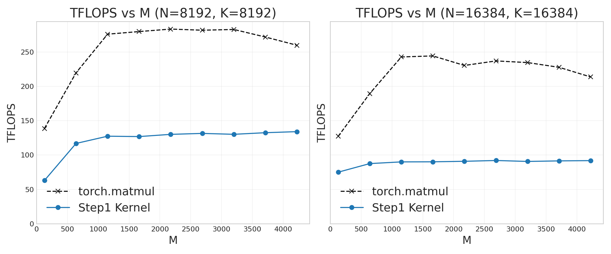
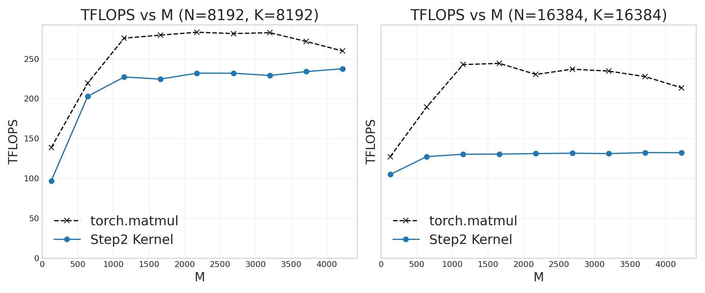
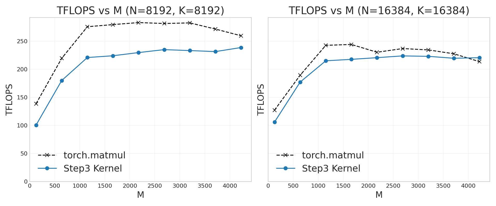
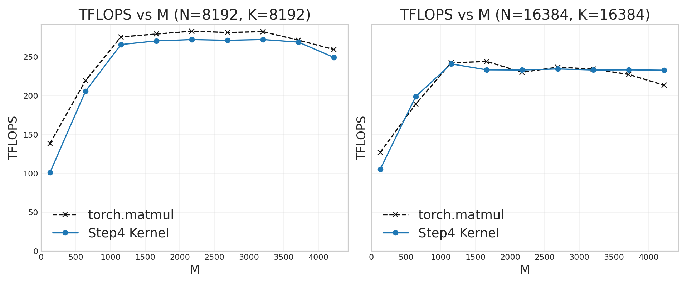

# 从零手搓昇腾Matmul，用100行Python追平CANN主线库性能 <br/>(基于 PTO-ISA 的逐步优化指南)

For English version see [matmul_optim_guide.md](./matmul_optim_guide.md)

- 日期：2026/03/12

# 目录

- [写作动机](#motivation)
- [第 0 步：给CUDA/Triton用户的NPU编程速通](#step-0-npu-programming-crash-course-for-cudatriton-programmers)
  - [NPU kernel launch行为](#typical-kernel-launch-syntax)
  - [Software pipelining，自动vs手动](#auto-vs-manual-software-pipelining)
- [第 1 步：功能正确的基础版本](#step-1-functionally-correct-naive-version)
- [第 2 步：Double buffering](#step-2-double-buffering)
- [第 3 步：通过 "Swizzling" 提升 L2 cache 复用](#step-3-swizzling-for-l2-cache-reuse)
- [第 4 步：（可选）手动 software pipelining](#step-4-optional-manual-software-pipelining)
- [附录 A：PTO-DSL 语法说明](#appendix-a-pto-dsl-syntax-note)
- [附录 B：NPU profiler 使用方法](#appendix-b-using-npu-profiler)

**复现本文全部结果**，见 [README.md](./README.md) 里的命令。

<a id="motivation"></a>
# 写作动机

本文是NPU版本的“Matmul算子逐步优化实录”。这类文章在友商GPU十分流行（比如[这篇A100的](https://siboehm.com/articles/22/CUDA-MMM)和[这篇H100的](https://cudaforfun.substack.com/p/outperforming-cublas-on-h100-a-worklog)），但在我司的NPU上似乎还没有过公开的“从零手搓”教程。

我们会逐步把一个基于**约100行Python DSL**的算子优化到持平主线库的性能。对照的性能基线是NPU上的`torch.matmul`，内部调用[aclnnMatmul](https://www.hiascend.com/document/detail/zh/canncommercial/850/API/aolapi/context/ops-nn/aclnnMatmul.md)（NPU的“cuBLAS平替”），实现方式为[上万行的AscendC代码](https://gitcode.com/cann/ops-nn/tree/v8.5.0/matmul/mat_mul_v3/op_kernel)。

本教程的代码坚持：**极简、易于魔改、不带黑盒模板封装**，只提炼**少数最关键的**性能优化点。还有些更全面的、对corner case考虑更细致的Matmul实现例如[Catlass的矩阵乘模板总结](https://gitcode.com/cann/catlass/blob/master/docs/contents/advanced/matmul_template_summary.md)和[AscendC的Matmul性能优化策略总览](https://www.hiascend.com/document/detail/zh/canncommercial/850/opdevg/Ascendcopdevg/atlas_ascendc_best_practices_10_10006.html)，把大量优化都藏在了模板和封装里，适合作为后续进阶材料。

<a id="step-0-npu-programming-crash-course-for-cudatriton-programmers"></a>
# 第 0 步：给 CUDA/Triton 用户的 NPU 编程速通

（如果你已经写过NPU算子，可快速略过本节）

<a id="typical-kernel-launch-syntax"></a>
## NPU kernel launch行为

NPU上[SPMD](https://en.wikipedia.org/wiki/Single_program,_multiple_data)风格的kernel看起来和CUDA/Triton语法**似乎很像**：
- 内置变量`block_idx`和`block_num`用于每个core的地址offset计算 -- [示例](https://github.com/huawei-csl/pto-dsl/blob/7f8176a648c7c4ca03b09bd75f8b615d4bac0eaf/examples/jit/add_dynamic_multicore/run_add.py#L46-L51)
- CUDA画风的`kernel_name<<<block_dim>>>(args)`kernel launch方式 -- [示例](https://github.com/huawei-csl/pto-dsl/blob/7f8176a648c7c4ca03b09bd75f8b615d4bac0eaf/examples/aot/add_dynamic_multicore/caller.cpp#L11)

其实二者有个关键区别：NPU算子的写法基本都属于CUDA术语里的["persistent kernels"](https://triton-lang.org/main/getting-started/tutorials/09-persistent-matmul.html)，也就是`block_dim`等于硬件的核数，而不是随着输入数据size增长。

例如这个[基于PTO的动态shape向量相加](https://github.com/huawei-csl/pto-dsl/blob/d923ac2ed3c1a2180475c1d279699ea952022e77/examples/jit/add_dynamic_multicore/run_add.py#L46-L100)：每个core不仅自己算好global memory offset，计算的循环迭代次数也会[随着动态的输入数据size而增加](https://github.com/huawei-csl/pto-dsl/blob/d923ac2ed3c1a2180475c1d279699ea952022e77/examples/jit/add_dynamic_multicore/run_add.py#L83)。这和常规的（非“persistent”）CUDA/Triton kernel 不一样。比如 [Triton vector add](https://triton-lang.org/main/getting-started/tutorials/01-vector-add.html#compute-kernel) 设定 `grid = (ceil_div(n_elements, BLOCK_SIZE),)`，用launch时动态计算的`block_dim`匹配动态input size；而我们大多数的NPU kernel（不管基于PTO、AscendC、CCE 还是其他框架）通常都是 `grid = (num_cores,)`。

（在NPU上，大于核数的`block_dim`在简单场景能跑通，但Cube-Vector核间同步容易出bug。而且`block_dim >= 65536`会溢出，远小于CUDA的`maxGridSize`。我们遇过这个bug，通过切回“persistent-kernel”写法[修好了](https://github.com/huawei-csl/pto-kernels/pull/39)）

<a id="auto-vs-manual-software-pipelining"></a>
## Software pipelining，自动vs手动

NPU的片上缓存为[scratchpad memory](https://en.wikipedia.org/wiki/Scratchpad_memory)，而非硬件管理的cache。所以要避免[data hazards](https://en.wikipedia.org/wiki/Hazard_(computer_architecture)#Data_hazards)需要开发者或编译器正确地使用[set_flag & wait_flag 接口](https://www.hiascend.com/document/detail/zh/CANNCommunityEdition/850/API/cceintrinsicapi/cceapi_0106.html)，本质上是基于 [binary semaphore](https://en.wikipedia.org/wiki/Semaphore_(programming)#Producer%E2%80%93consumer_problem) 的同步机制。CUDA里最接近的是[`cp.async`+`wait`那一套](https://docs.nvidia.com/cuda/cuda-programming-guide/04-special-topics/async-copies.html)。可以参考这个[基于PTO-ISA手动同步的vector add示例](https://github.com/PTO-ISA/pto-isa/blob/5de2d24d53e8cf39dec5fc11f997d1e74fa7190c/demos/torch_jit/add/add_custom.cpp#L78-L115)。对更复杂的融合算子如[FlashAttention](https://github.com/PTO-ISA/pto-isa/tree/5de2d24d53e8cf39dec5fc11f997d1e74fa7190c/kernels/manual/common/flash_atten)，思考手动同步、software pipelining 和 prefetching, 对算子开发人员过于烧脑。

为了解决这个痛点，[PTO-DSL](https://github.com/huawei-csl/pto-dsl) 提供了自动同步，内部由基于[PTO MLIR dialect](https://github.com/zhangstevenunity/PTOAS/blob/8eb9e23fa95e18c3db789e0a171a98df07a8a846/docs/PTO_IR_manual.md)的[InsertSync pass](https://github.com/zhangstevenunity/PTOAS/tree/8eb9e23fa95e18c3db789e0a171a98df07a8a846/lib/PTO/Transforms/InsertSync)实现。对用户而言，算子代码看起来还是“串行的”（在pipelining意义上），写起来更接近Triton/CuTile的手感。

<a id="step-1-functionally-correct-naive-version"></a>
# 第 1 步：功能正确的基础版本

根据[NPU硬件架构](https://www.hiascend.com/document/detail/zh/CANNCommunityEdition/850/opdevg/Ascendcopdevg/atlas_ascendc_10_0008.html)，要完成matmul需要的数据搬运路径是：
- `GM`（global memory）-> `L1` -> `L0`（左/右操作数对应`L0A`/`L0B`）-> `Cube core` -> `L0C` -> `GM`

读取到片上的tile 大小（算法参数）受到 L1/L0 SRAM容量（硬件参数）的约束。要查询[硬件参数规格](https://www.hiascend.com/document/detail/zh/CANNCommunityEdition/850/opdevg/Ascendcopdevg/atlas_ascendc_10_0011.html)，可以在任意安装了CANN的环境里看文件 `${ASCEND_HOME_PATH}/arm64-linux/data/platform_config/*.ini`：

```bash
grep -A 9 "AICoreSpec" ${ASCEND_HOME_PATH}/arm64-linux/data/platform_config/Ascend910B2.ini
```

输出：

```
[AICoreSpec]
...
l0_a_size=65536  # 64 KiB
l0_b_size=65536  # 64 KiB
l0_c_size=131072  # 128 KiB
l1_size=524288  # 512 KiB
```

考虑经典的[分块矩阵乘法](https://en.wikipedia.org/wiki/Loop_nest_optimization#Example:_matrix_multiplication)。任意shape的`C = A @ B`运算会被分解为tile级别操作：`A_tile = A[i1:i2,k1:k2]`、`B_tile = B[k1:k2,j1:j2]`、`C_tile = C[i1:i2,j1:j2]`，保证每个 tile 能放进 SRAM。结合上面的 SRAM 信息，这里选择：
- `A_tile` 在 `L1` 上为 `[128 x 512]`，占 128 KiB（fp16）
- `B_tile` 在 `L1` 上为 `[256 x 256]`，占 128 KiB（fp16）
- `A_tile` 在 `L0A` 上为 `[128 x 64]`，占 16 KiB（fp16）
- `B_tile` 在 `L0B` 上为 `[64 x 256]`，占 32 KiB（fp16）
- `C_tile` 在 `L0C` 上为 `[128 x 256]`，占 128 KiB（fp32 accumulation）
- Cube unit执行size为`(M, N, K) = (128, 256, 64)` 的 [`TMATMUL`](https://github.com/PTO-ISA/pto-isa/blob/5de2d24d53e8cf39dec5fc11f997d1e74fa7190c/docs/isa/TMATMUL.md) 指令，输入为 `L0A` 和 `L0B`，输出为 `L0C`。

为啥选这组参数：
- 这是[ATB 库的matmul](https://gitcode.com/cann/ascend-transformer-boost/blob/br_release_cann_8.5.0_20260527/src/kernels/kernels/matmul/pp_matmul_f16_kernel/op_kernel/pp_matmul.cce?init=initTree) 的常用tiling方案之一。也有其他很多可行组合，只要 buffer 能装下。
- L0上更大的tile有利于Cube unit达到更高的FLOPS。比如128 x 128比32 x 32的FLOPs高好几倍。完整支持的 matmul shape 和 dtype 参见[`Mmad`指令](https://www.hiascend.com/document/detail/zh/CANNCommunityEdition/850/API/ascendcopapi/atlasascendc_api_07_0249.html)。
- `L1`、`L0A`、`L0B` 都预留了 >=50% 空间没用，留给下一步double-buffering用。

[step1_baseline_numpy_sim.py](./step1_baseline_numpy_sim.py) 提供了“NumPy 仿真代码”帮助理解算法逻辑。这里用的算法是最基础的 “split-MN matmul”，每个 core 输出自己的 `C_tile = C[i1:i2,j1:j2]`。(Split-K 和 Stream-K等变种留到以后再说)。算法核心逻辑如下：
- 顶层循环 `for li in range(core_loop):` 来自前文的“persistent kernel”要求。我们不做双层“行列循环”，而是把它们合并成单层 `core_loop = n_loop * m_loop`。这样每次迭代都可以独立分配给不同 core，并独立完成一个 `C_tile`。
- 然后只需沿内层 K 维做累加：
    - 第二层 `for k_idx in range(k_dtile_num)` 对应 “GM - L1 级”迭代：当前 `L1` tile 被 matmul 用完后，再从 `GM` 加载下一个。
    - 第三层 `for phase in range(8):` 对应 “L1 - L0 级”迭代：当前 `L0` tile 被 matmul 用完后，再从 `L1` 加载下一个。
    - 由于 `L1` tile 和 `L0` tile 的尺寸比固定，第三层循环可以**静态展开**。因为 `L0` tile 小于 `L1` tile，每次 “L1 级”迭代会对应多个 “L0 级”迭代。

接着把NumPy翻译成等价的PTO-DSL，见 [step1_baseline.py](./step1_baseline.py) 和 [common_utils.py](./common_utils.py)。代码结构几乎一一对应，只是把NumPy API换成了NPU特有的API：
- `pto.load`（[`TLOAD`](https://github.com/PTO-ISA/pto-isa/blob/5de2d24d53e8cf39dec5fc11f997d1e74fa7190c/docs/isa/TLOAD.md)）做 `GM`->`L1`
- `tile.extract`（[`TEXTRACT`](https://github.com/PTO-ISA/pto-isa/blob/5de2d24d53e8cf39dec5fc11f997d1e74fa7190c/docs/isa/TEXTRACT.md)）做 `L1`->`L0A`、`L1`->`L0B`
- `tile.matmul`/`tile.matmul_acc`（[`TMATMUL`](https://github.com/PTO-ISA/pto-isa/blob/5de2d24d53e8cf39dec5fc11f997d1e74fa7190c/docs/isa/TMATMUL.md)/[`TMATMUL_ACC`](https://github.com/PTO-ISA/pto-isa/blob/5de2d24d53e8cf39dec5fc11f997d1e74fa7190c/docs/isa/TMATMUL_ACC.md)）做 `L0` 上的计算
- `pto.store`（[`TSTORE`](https://github.com/PTO-ISA/pto-isa/blob/5de2d24d53e8cf39dec5fc11f997d1e74fa7190c/docs/isa/TSTORE.md)）做 `L0C`->`GM`
- 静态loop unrolling用 Python 原生 `for i in range()`；run-time动态循环用 `for i in pto.range()`。`if`/`else` 也同理类似。

更详细的DSL语法说明见 [附录 A：PTO-DSL 语法说明](#appendix-a-pto-dsl-syntax-note)。

这个80行的算子实现可以在NPU跑出正确的数值结果，但性能只有 `torch.matmul` 的 50% 左右。下一节追上性能差距。



<a id="step-2-double-buffering"></a>
# 第 2 步：Double buffering

先用 `msprof op simulator` 测试前一版 kernel：

```bash
msprof op simulator --aic-metrics=PipeUtilization \
    --kernel-name="_Z28matmul_kernel_step1_baselinePDhS_S_iii_mix_aic" \
    --output="msprof_res" --launch-count=5 \
    python ./run_matmul.py --variant step1-baseline
```

（更多 profiler 用法见 [附录 B：NPU profiler 使用方法](#appendix-b-using-npu-profiler)）

可以看到 Cube core 有 50% 时间在空转：


做了Double buffering（本质是用空间换时间），可以把计算和数据传输尽量重叠：


完整代码见 [./step2_doublebuffer.py](./step2_doublebuffer.py)。

Profile改进后的算子：

<details>

```bash
msprof op simulator --aic-metrics=PipeUtilization \
    --kernel-name="_Z26matmul_kernel_ABt_autosyncPDhS_S_iii_mix_aic" \
    --output="msprof_res" --launch-count=5 \
    python ./run_matmul.py --variant step2-doublebuffer
```

</details>

唯一的代码改动是在 `L1` 和 `L0` 上给 `A_tile`、`B_tile` 各开 2 份 buffer：

```python
a_l1 = [pto.alloc_tile(tile_buf_a_l1), pto.alloc_tile(tile_buf_a_l1)]
b_l1 = [pto.alloc_tile(tile_buf_b_l1), pto.alloc_tile(tile_buf_b_l1)]
a_l0 = [pto.alloc_tile(tile_buf_a_l0), pto.alloc_tile(tile_buf_a_l0)]
b_l0 = [pto.alloc_tile(tile_buf_b_l0), pto.alloc_tile(tile_buf_b_l0)]
```

然后在迭代之间交替使用 "odd" / "even" 两块 buffer。

优化效果显著，对于中小规模的矩阵，FLOPs 基本翻倍：


但矩阵一旦变大（比如 16384x16384），FLOPs 会**突然跌落**。原因是 NPU 的 L2 cache 装不下整块矩阵，开始出现 cache eviction。

查看 L2 cache 大小：

```bash
grep -A 8 "SoCInfo" ${ASCEND_HOME_PATH}/arm64-linux/data/platform_config/Ascend910B2.ini
```

输出：

```
[SoCInfo]
ai_core_cnt=24
cube_core_cnt=24
vector_core_cnt=48
ai_cpu_cnt=6
memory_type=
memory_size=68719476736  # 64 GiB
l2_type=0
l2_size=201326592  # 192 MiB
```

8192x8192 矩阵（float16 下 64 MiB）小于 L2；而16384x16384（float16 下 256 MiB）大于 L2，所以后者的性能显著更差。

`910B4` 的 HBM 和 L2 都是 910B2 的一半（因此更小矩阵就会触发cache eviction）：

```bash
grep -A 8 "SoCInfo" ${ASCEND_HOME_PATH}/arm64-linux/data/platform_config/Ascend910B4.ini
```

```
[SoCInfo]
ai_core_cnt=20
cube_core_cnt=20
vector_core_cnt=40
ai_cpu_cnt=6
memory_type=
memory_size=34359738368  # 32 GiB
l2_type=0
l2_size=100663296  # 96 MiB
```

<a id="step-3-swizzling-for-l2-cache-reuse"></a>
# 第 3 步：通过 "Swizzling" 提升 L2 cache 复用

提高多核之间的L2 cache复用，“swizzling”是最常用的技巧，对NPU和GPU都适用。下图借自 [Triton matmul讲解](https://triton-lang.org/main/getting-started/tutorials/03-matrix-multiplication.html#l2-cache-optimizations)：


这张图可以这样理解：假设第一轮迭代有9个核各自在算 `C` 的一个子块（黄色标记区域，0~8 是 core id）。在朴素的 "row-major ordering" 下，完整 B 矩阵（假设大于 L2）要频繁从 global memory 读取；而用 "grouped ordering" 后，global memory traffic大幅下降。

[step3_swizzle.py](./step3_swizzle.py) 在 step2 基础上只加了一个 10 行 swizzle 函数 `swizzle_nz`，其余代码完全不动。[step3_swizzle_numpy_sim.py](./step3_swizzle_numpy_sim.py) 直观解释了swizzle对循环下标的影响。这个具体swizzle方案来自[catlass的block swizzle](https://gitcode.com/cann/catlass/blob/v1.4.0/include/catlass/gemm/block/block_swizzle.hpp)([讲解文档](https://gitcode.com/cann/catlass/blob/v1.4.0/docs/contents/advanced/swizzle_explanation.md))。

（For GPU熟练工: 这个下标重映射类似[DeepGEMM的scheduler](https://github.com/deepseek-ai/DeepGEMM/blob/v2.1.1/deep_gemm/include/deep_gemm/common/scheduler.cuh)，重排每个SM的数据分配和循环顺序）

只加这 10 行 swizzle，FLOPs 就有明显提升，达到了`torch.matmul`的90%！



为了确认是L2 cache在起作用，用`msprof op`检查cache hit：

```bash
msprof op \
    --aic-metrics=Occupancy,Roofline,Default,L2Cache,PipeUtilization,MemoryL0 \
    --kernel-name="_Z26matmul_kernel_ABt_autosyncPDhS_S_iii_mix_aic" \
    --output="msprof_res" --launch-count=5 \
    python ./run_matmul.py --variant step3-swizzle
```

对4096x4096小矩阵，即使不用swizzled loop order，L2 hit就很高（97.88%）：
 


对16384x16384大矩阵，由于超过了L2 size，不swizzle的话L2 hit低到了30.9%：


加了swizzling后，16384x16384场景的L2 hit 提升到93.72%了：


<a id="step-4-optional-manual-software-pipelining"></a>
# 第 4 步：（可选）手动 software pipelining

最后这 10% 的性能差距，可以通过 [./step4_manual_pipelining.py](./step4_manual_pipelining.py) 里的手动排流水压榨出来。



即便做了手动同步，代码也只是从 ~100 行增长到 ~150 行 Python，仍然比CANN算子库的代码短很多。如何手工排流水超出了本文的讲解范围。我们正在 [推进相关 compile pass](https://github.com/zhangstevenunity/PTOAS/issues/226)，争取让编译器自动同步性能持平手排。

<a id="appendix-a-pto-dsl-syntax-note"></a>
# 附录 A：PTO-DSL 语法说明

当前的 [PTO-DSL package](https://github.com/huawei-csl/pto-dsl/tree/3f0860b1e750f2c4d26a93c6501a212b60196863/ptodsl) 只是在 PTO dialect 的 [MLIR Python bindings](https://mlir.llvm.org/docs/Bindings/Python/)上做了很薄的封装。整个DSL包只有 **约1000行Python**（可以用 `cd ptodsl && find . -name "*.py" | xargs wc -l` 自行确认）

为了在开发阶段维持一个简单好改的框架，我们目前**不**做Python AST parsing / AST rewriting。因此，所有 Python 原生语法（包括`if`/`for` 控制流、Python class、iterator 等）都按普通Python代码执行。这点和其他Python DSL的做法不太相同：有的是纯 AST 路线（如 Triton、CuTile），有的是 AST+tracing 混合路线（如 Tilelang、CuteDSL），它们 *可能会，也可能不会* 把原生 `if`/`range` rewrite成特殊 IR builder（可参考 [CuteDSL 的复杂规则](https://github.com/Dao-AILab/quack/blob/v0.3.2/docs/dsl_control_flow.rst)）。当前 PTO-DSL frontend 是纯 Python tracing，更接近 JAX 的思路。

**用户只要记住：** run-time动态控制流全在 `pto` 命名空间里（例如 `pto.range`，会在 IR 中生成 [MLIR structured control flow](https://mlir.llvm.org/docs/Dialects/SCFDialect/)）；而 Python 原生控制流是在 build-time 就求值完成的。

常见场景：

- **Python `for ... in range(...)`**
  - 在生成 IR 前执行（build-time）
  - 常用于编译期 metaprogramming / unrolling
- **`for ... in pto.range(...)`**
  - 生成 MLIR `scf.for` loop
  - 在 kernel run-time 动态执行
- **Python `if condition:`**
  - condition 在 build-time 由 Python 求值
  - 分支在生成 IR 前就被选定
- **`with pto.if_context(cond):` / `pto.cond(...)`**
  - 在 IR 中生成 runtime `scf.if`
  - condition 在 kernel 运行时求值

**示例 1：`pto.range`（IR 里的 runtime loop）**

来自 `step1_baseline.py`：

```python
for li in pto.range(bid, core_loop, num_blocks):
    ...
```

这**不是**普通Python循环。在 PTO-DSL 里，`pto.range` 是一个 IR-builder primitive（见 `control_flow.py`），会创建 `scf.ForOp` 并返回 induction-variable。

实际效果：会以 loop 形式保留在 IR 里（不会被 Python 展开）

**示例 2：Python `range`（build-time unrolling）**

来自 `step1_baseline.py`：

```python
for phase in range(8):
    ...
```

这个 loop 在构建 IR 时由 Python 执行，所以通常会在 IR 中生成 8 份重复代码区域。

类比C++编程：
- 概念上接近 compile-time codegen / metaprogramming
- 当 loop bound 是小常量时非常实用

**示例 3：Python `if` vs `pto.if_context`**

来自 `step1_baseline.py`：

```python
if phase == 0:
    with pto.if_context(is_first_k_tile, has_else=True) as branch:
        tile.matmul(a_l0, b_l0, c_l0)
    with branch.else_context():
        tile.matmul_acc(c_l0, a_l0, b_l0, c_l0)
else:
    tile.matmul_acc(c_l0, a_l0, b_l0, c_l0)
```

理解方式：
- `if phase == 0` 是 **普通Python** 分支（build-time）
- `pto.if_context(is_first_k_tile, ...)` 在 IR 中生成 **runtime** 分支

<a id="appendix-b-using-npu-profiler"></a>
# 附录 B：NPU profiler 使用方法

`--kernel-name=` 参数里的 kernel 名字怎么找：先不带 `--kernel-name=` 跑一次 `msprof op`，输出里会直接打印 kernel 名。

完整官方文档见 [msProf](https://www.hiascend.com/document/detail/zh/canncommercial/850/devaids/optool/atlasopdev_16_0082.html)。

查看 profiler trace 的 UI 工具下载：

```bash
# Windows x86
wget https://ascend-repo.obs.cn-east-2.myhuaweicloud.com/MindStudio/MindStudio%208.3.0/MindStudio-Insight_8.3.0_win.exe

# Mac arm and x86
wget https://ascend-repo.obs.cn-east-2.myhuaweicloud.com/MindStudio/MindStudio%208.3.0/MindStudio-Insight_8.3.0_darwin-aarch64.dmg
wget https://ascend-repo.obs.cn-east-2.myhuaweicloud.com/MindStudio/MindStudio%208.3.0/MindStudio-Insight_8.3.0_darwin-x86_64.dmg

# Linux arm and x86
wget https://ascend-repo.obs.cn-east-2.myhuaweicloud.com/MindStudio/MindStudio%208.3.0/MindStudio-Insight_8.3.0_linux-aarch64.zip
wget https://ascend-repo.obs.cn-east-2.myhuaweicloud.com/MindStudio/MindStudio%208.3.0/MindStudio-Insight_8.3.0_linux-x86_64.zip
```

以上链接来自 [CANN 下载页](https://www.hiascend.com/developer/download/community/result?module=sto)。
